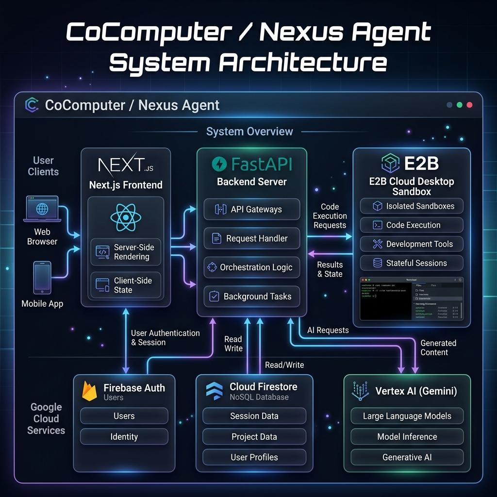
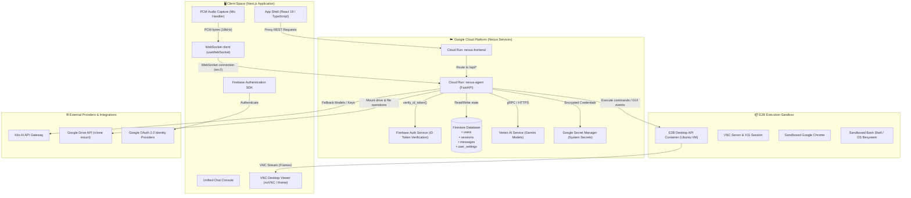
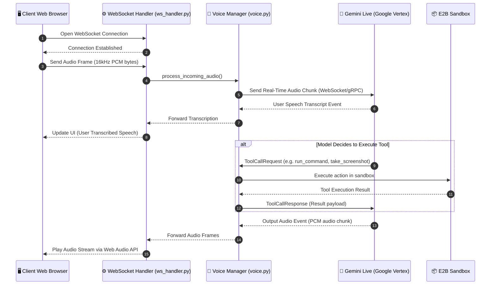
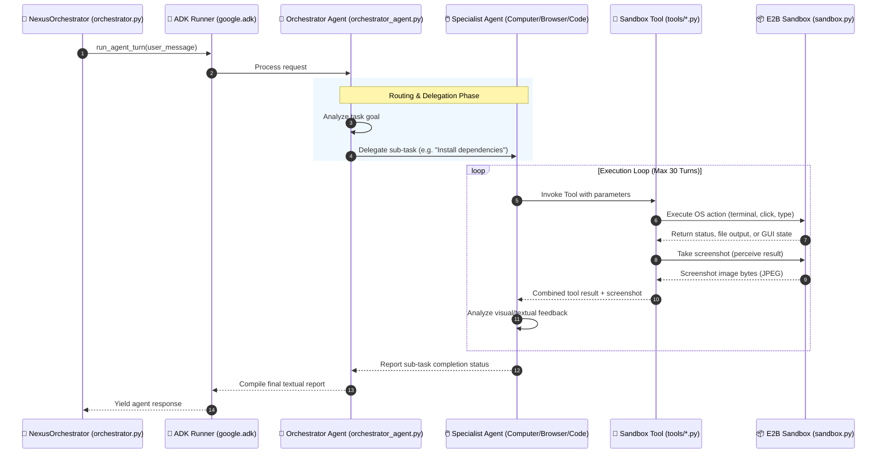
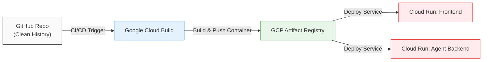

# CoComputer: System Architecture Specification

This document provides a detailed specification of the CoComputer (Nexus Agent) system architecture, tracing the pathways of frontend user interaction, the backend orchestrator, the multi-agent system, the E2B sandbox, and external integrations.

---

## 🗺️ 1. High-Level Component Topology

Below is the layout of the system components and their networks.





---

## 📂 2. Backend Directory & Component Mapping

The following diagram maps the logical backend structure located under the [agent/nexus/](file:///c:/Users/deeks/OneDrive/Documents/nexus-agent-main/agent/nexus) directory to their functional responsibilities in Python:

```text
agent/nexus/
├── agents/                       # Google ADK multi-agent configurations
│   ├── __init__.py
│   ├── orchestrator_agent.py     # Root Agent: determines routing & tool delegation
│   ├── sub_agents.py             # Custom Agent types: Computer, Browser, Code
├── prompts/                      # Prompt templates for system guiding and personas
│   ├── __init__.py
│   └── system.py
├── tools/                        # Python functions registered as LLM tools
│   ├── __init__.py
│   ├── bash.py                   # Run shell commands in the E2B sandbox
│   ├── browser.py                # Launch and scrape web browsers
│   ├── computer.py               # Simulate mouse movement, clicks, key presses
│   ├── screen.py                 # Capture screenshot frames of the sandbox desktop
│   └── integrations.py           # Sync operations, e.g. Rclone configurations
├── server.py                     # FastAPI application endpoints & REST handlers
├── ws_handler.py                 # Handles multiplexed real-time WebSocket traffic
├── orchestrator.py               # The main task loop driver (NexusOrchestrator)
├── voice.py                      # Connection manager for Gemini Live API
├── vision.py                     # Image analyzer for parsing screenshots via Gemini
├── sandbox.py                    # Life-cycle manager for E2B Docker containers
├── session.py                    # Active user sessions, metadata, and status tracker
├── auth.py                       # Token parsing, Firebase claim verification
└── crypto.py                     # BYOK (Bring Your Own Key) AES encryption engine
```

---

## 🔄 3. Detailed Processing Loops

### A. Live Audio Loop (Gemini Live)
The system leverages low-latency, bidirectional audio streaming using **Gemini Live 2.5 Flash**. The client streams raw audio inputs, and the backend bridges them to Google's Live API.



---

### B. Agent Reasoning & Tool-Calling Loop (Google ADK)
When the user sends a text command, or when voice instructs the system to perform a complex action, the **Google Agent Development Kit (ADK)** takes over to orchestrate actions recursively.



---

## 🔒 4. Authentication, Security, and Encryption (BYOK)

To safeguard user credentials and keep hosting costs transparent, CoComputer features a **Bring Your Own Key (BYOK)** encryption model.

1. **Authentication Flow**:
   - The user signs in on the Next.js Frontend using **Firebase Authentication** (Google OAuth).
   - This yields a Firebase ID Token, which is passed in the headers of all REST requests (`Authorization: Bearer <ID_TOKEN>`).
   - The backend interceptor ([auth.py](file:///c:/Users/deeks/OneDrive/Documents/nexus-agent-main/agent/nexus/auth.py)) verifies the signature using the Firebase Admin SDK and decodes user identifiers (`uid`).

2. **BYOK Encryption Protocol**:
   - When a user enters their personal API keys (Vertex AI, Anthropic, or E2B) in the Settings panel:
     - The FastAPI server generates a session/user-specific salt.
     - The key is encrypted inside [crypto.py](file:///c:/Users/deeks/OneDrive/Documents/nexus-agent-main/agent/nexus/crypto.py) using **AES-GCM-256** encryption.
     - The encrypted ciphertext is stored in the Firestore user profile.
   - When launching an E2B Sandbox or starting an orchestrator turn:
     - The server fetches the ciphertext from Firestore.
     - It decrypts the keys in-memory.
     - The decrypted keys are injected as transient environment variables in the E2B sandbox session or passed directly to the `google.genai.Client`. They are never written to disk or logged.

---

## 🌐 5. Deployment Setup



- **CI/CD Configuration**: Configured under [.github/workflows/google-cloudrun-docker.yml](file:///c:/Users/deeks/OneDrive/Documents/nexus-agent-main/.github/workflows/google-cloudrun-docker.yml). It automates Cloud Run container updates on pushing code commits.
- **Port Mapping**:
  - The Frontend container operates on port `3000`.
  - The Backend container operates on port `8080`.
- **CORS Handling**: Backend specifies CORS origins, which dynamically update to match the frontend Cloud Run URL on deployment.
